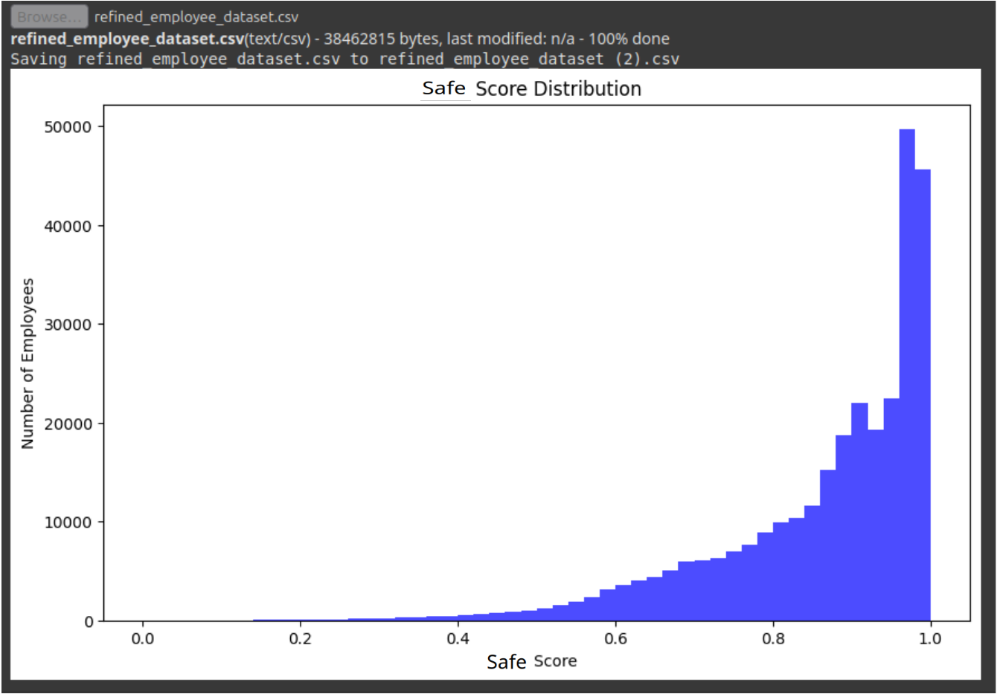

# Insider Threat Detection with Isolation Forest

## Overview

This project uses machine learning (Isolation Forest algorithm) to detect insider threats in employee datasets. It analyzes numerical features, assigns risk scores, and flags anomalies (normal, suspicious, insider). Results are saved to a CSV file and visualized as a histogram.

## Folder Structure

```
hepsi_hac/
│
├── main.py
├── dataset/
│   └── refined_employee_dataset.csv
├── insider_threat_results.csv   # Generated after running main.py
├── risk_score_distribution.png  # Generated plot
└── README.md
```

## Requirements

- Python 3.7+
- pandas
- scikit-learn
- matplotlib

Install dependencies with:

```powershell
pip install pandas scikit-learn matplotlib
```

## How It Works

1. **Load Data:** Reads `dataset/refined_employee_dataset.csv`.
2. **Feature Selection:** Selects all numerical columns except the target (`is_emp_malicious`).
3. **Preprocessing:** Fills missing values with zero and normalizes features.
4. **Model Training:** Trains an Isolation Forest to detect anomalies.
5. **Scoring:** Assigns a risk score to each employee.
6. **Flagging:** Categorizes employees as `normal`, `suspicious`, or `insider`.
7. **Output:** Saves results to `insider_threat_results.csv` and generates a histogram plot.

## Usage

1. Place your dataset in the `dataset` folder as `refined_employee_dataset.csv`.
2. Run the script:

   ```powershell
   python main.py
   ```

3. After execution:
   - Results are saved in `insider_threat_results.csv`.
   - A plot of risk score distribution is saved as `risk_score_distribution.png`.


## Output Example

### Results CSV

The output CSV contains:
- All original columns
- `raw_score`: Isolation Forest decision function value
- `risk_score`: Normalized risk score (0 to 1)
- `anomaly_flag`: Categorization (`normal`, `suspicious`, `insider`)

### Risk Score Distribution Plot

This plot shows the distribution of risk scores assigned to employees by the Isolation Forest model. It helps visualize how many employees fall into each risk category (normal, suspicious, insider).


---

## Screenshots & Analysis

Below are additional screenshots that illustrate various aspects of the project, its results, and its interface:

### 1. Screenshot 2025-08-16 201247.png
This screenshot likely shows the initial output or a summary table from the model, such as the risk scores and anomaly flags assigned to employees. It helps visualize how the model categorizes data and the distribution of results.


### 2. Screenshot 2025-08-16 201657.png
This image may display a more detailed view, such as a zoomed-in section of the results, a confusion matrix, or a feature importance plot. It provides deeper insight into the model's performance and decision boundaries.


### 3. InSid_Frontend.png
This screenshot appears to be from a frontend interface for the project, possibly showing a dashboard or user interface where results are presented interactively. It demonstrates how the model's output can be integrated into a user-facing application.


### 4. InSid_ML_Safe.png
This image likely visualizes employees flagged as 'safe' by the ML model, showing how the system identifies normal behavior and distinguishes it from suspicious or insider threats.



### 5. InSId ML.png
This screenshot may show the machine learning workflow, model architecture, or another aspect of the ML process. It helps users understand the steps and logic behind the threat detection system.


---

## Customization

- **Contamination Rate:** Adjust `contamination=0.05` in `main.py` to change model sensitivity.
- **Thresholds:** Modify the `categorize_anomaly` function to change risk categorization.

## Troubleshooting

- Ensure your CSV file is named `refined_employee_dataset.csv` and placed in the `dataset` folder.
- If you get a `FileNotFoundError`, check the file path and name.
- Install all required Python packages.

## License

This project is for educational and research purposes.
