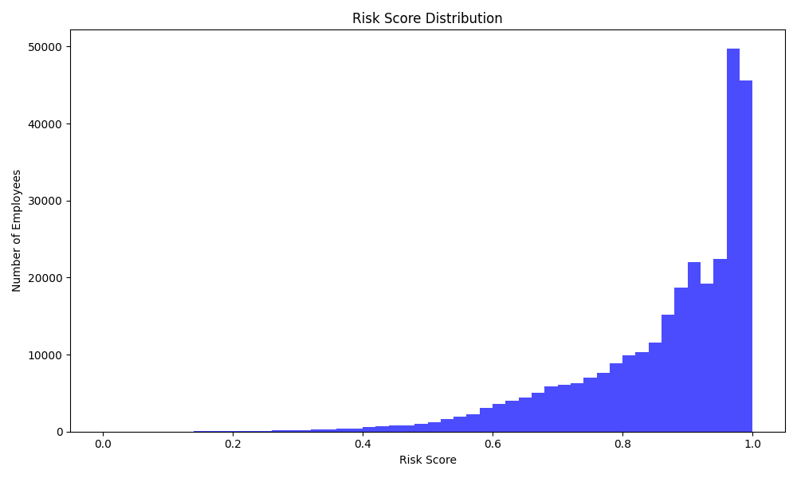

# Insider Threat Detection with Isolation Forest

## Overview

This project uses machine learning (Isolation Forest algorithm) to detect insider threats in employee datasets. It analyzes numerical features, assigns risk scores, and flags anomalies (normal, suspicious, insider). Results are saved to a CSV file and visualized as a histogram.

## Folder Structure

```
hepsi_hac/
│
├── main.py
├── dataset/
│   └── refined_employee_dataset.csv
├── insider_threat_results.csv   # Generated after running main.py
├── risk_score_distribution.png  # Generated plot
└── README.md
```

## Requirements

- Python 3.7+
- pandas
- scikit-learn
- matplotlib

Install dependencies with:

```powershell
pip install pandas scikit-learn matplotlib
```

## How It Works

1. **Load Data:** Reads `dataset/refined_employee_dataset.csv`.
2. **Feature Selection:** Selects all numerical columns except the target (`is_emp_malicious`).
3. **Preprocessing:** Fills missing values with zero and normalizes features.
4. **Model Training:** Trains an Isolation Forest to detect anomalies.
5. **Scoring:** Assigns a risk score to each employee.
6. **Flagging:** Categorizes employees as `normal`, `suspicious`, or `insider`.
7. **Output:** Saves results to `insider_threat_results.csv` and generates a histogram plot.

## Usage

1. Place your dataset in the `dataset` folder as `refined_employee_dataset.csv`.
2. Run the script:

   ```powershell
   python main.py
   ```

3. After execution:
   - Results are saved in `insider_threat_results.csv`.
   - A plot of risk score distribution is saved as `risk_score_distribution.png`.

## Output Example

### Results CSV

The output CSV contains:
- All original columns
- `raw_score`: Isolation Forest decision function value
- `risk_score`: Normalized risk score (0 to 1)
- `anomaly_flag`: Categorization (`normal`, `suspicious`, `insider`)

### Risk Score Distribution Plot

Below is an example screenshot of the output plot:



*(Replace this with your actual screenshot after running the code.)*

## Customization

- **Contamination Rate:** Adjust `contamination=0.05` in `main.py` to change model sensitivity.
- **Thresholds:** Modify the `categorize_anomaly` function to change risk categorization.

## Troubleshooting

- Ensure your CSV file is named `refined_employee_dataset.csv` and placed in the `dataset` folder.
- If you get a `FileNotFoundError`, check the file path and name.
- Install all required Python packages.

## License

This project is for educational and research purposes.
