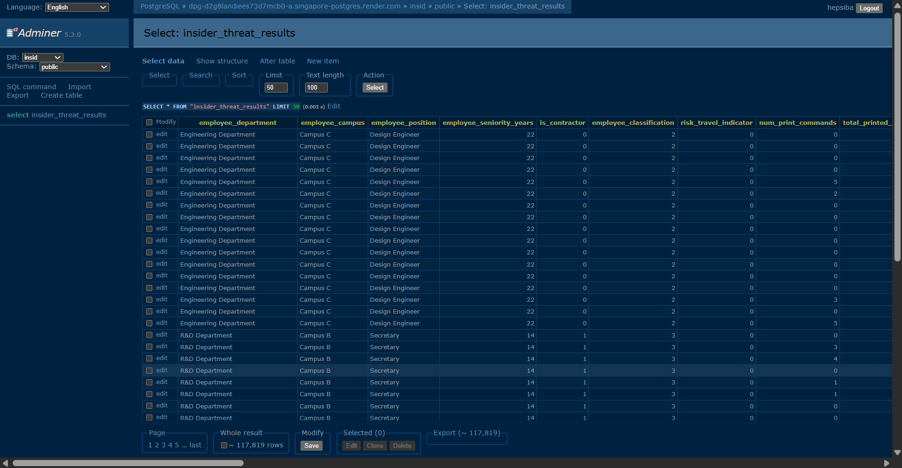
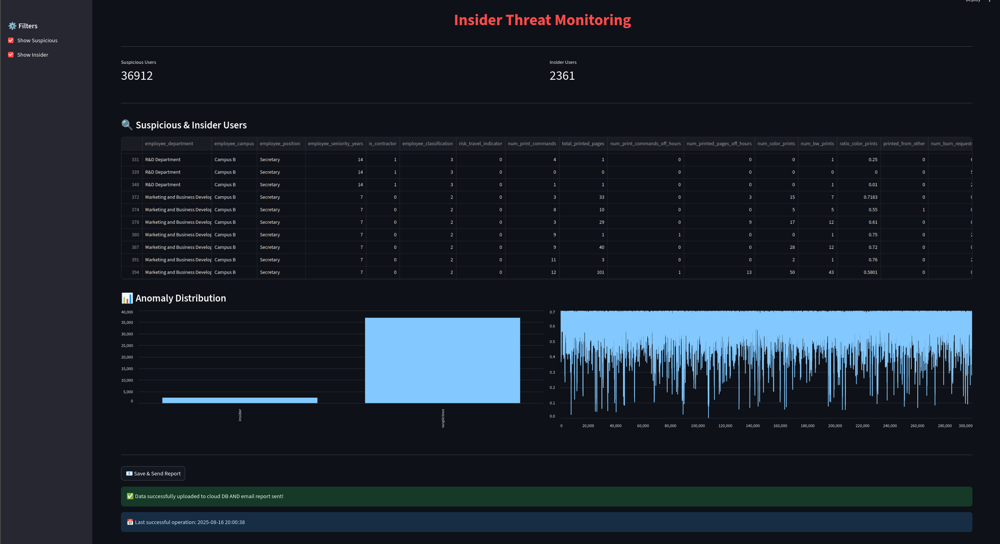
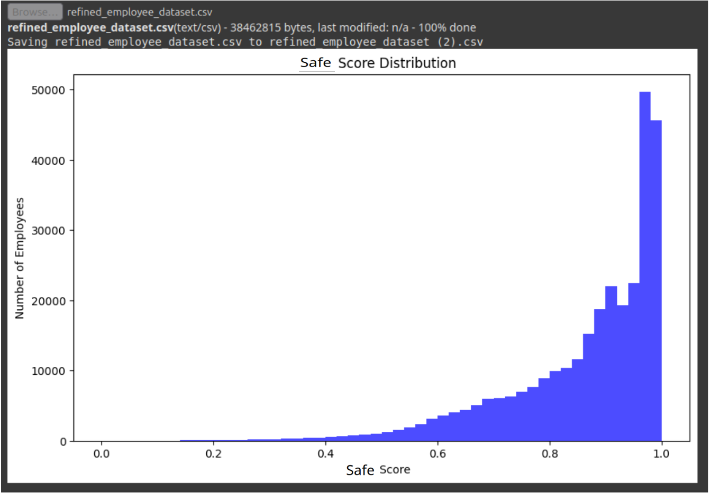

# Insider Threat Detection 

## Overview

This project uses machine learning (Isolation Forest algorithm) to detect insider threats in employee datasets. It analyzes numerical features, assigns safe scores, and flags anomalies (normal, suspicious, insider). Results are saved to a CSV file and visualized as a histogram.

## Folder Structure

```
hepsi_hac/
│
├── Backend/
│   ├── main.py
│   ├── dataset/
│   │   └── refined_employee_dataset.csv
│   ├── requirements.txt
│   ├── insider_threat_results.csv   # Generated after running main.py
│
├── Frontend&Database/
│   └── requirements.txt
│
├── Screenshots/
│   ├── InSid_database.png
│   ├── InSid_email_alert.png
│   ├── InSid_Frontend.png
│   ├── InSid_ML_Safe.png

│
└── README.md
```

## Requirements

- Python 3.7+
- pandas
- scikit-learn
- matplotlib

Install backend dependencies with:

```powershell
cd Backend
pip install -r requirements.txt
```

## How It Works

1. **Load Data:** Reads `Backend/dataset/refined_employee_dataset.csv`.
2. **Feature Selection:** Selects all numerical columns except the target (`is_emp_malicious`).
3. **Preprocessing:** Fills missing values with zero and normalizes features.
4. **Model Training:** Trains an Isolation Forest to detect anomalies.
5. **Scoring:** Assigns a safe score to each employee.
6. **Flagging:** Categorizes employees as `normal`, `suspicious`, or `insider`.
7. **Output:** Saves results to `Backend/insider_threat_results.csv` and generates a histogram plot.

## Usage

1. Navigate to the Backend folder:
   ```powershell
   cd Backend
   ```

2. Ensure your dataset is in the `Backend/dataset` folder as `refined_employee_dataset.csv`.

3. Run the script:
   ```powershell
   python main.py
   ```

4. After execution:
   - Results are saved in `Backend/insider_threat_results.csv`.
   - A plot of safe score distribution is saved as `Backend/safe_score_distribution.png`.


## Output Example

### Results CSV

The output CSV contains:
- All original columns
- `raw_score`: Isolation Forest decision function value
- `safescore`: Normalized safe score (0 to 1)
- `anomaly_flag`: Categorization (`normal`, `suspicious`, `insider`)

---

## Screenshots & Analysis

Below are additional screenshots that illustrate various aspects of the project, its results, and its interface:

### 1. InSid_database.png
This screenshot likely shows the initial output or a summary table from the model, such as the safe scores and anomaly flags assigned to employees. It helps visualize how the model categorizes data and the distribution of results.



### 2.InSid_email_alert.png
This image may display a more detailed view, such as a zoomed-in section of the results, a confusion matrix, or a feature importance plot. It provides deeper insight into the model's performance and decision boundaries.


### 3. InSid_Frontend.png
This screenshot appears to be from a frontend interface for the project, possibly showing a dashboard or user interface where results are presented interactively. It demonstrates how the model's output can be integrated into a user-facing application.



### 4. InSid_ML_Safe.png
This image likely visualizes employees flagged as 'safe' by the ML model, showing how the system identifies normal behavior and distinguishes it from suspicious or insider threats.




---

## Customization

- **Contamination Rate:** Adjust `contamination=0.05` in `Backend/main.py` to change model sensitivity.
- **Thresholds:** Modify the `categorize_anomaly` function to change risk categorization.

## Troubleshooting

- Ensure your CSV file is named `refined_employee_dataset.csv` and placed in the `Backend/dataset` folder.
- If you get a `FileNotFoundError`, check the file path and name.
- Install all required Python packages using `pip install -r Backend/requirements.txt`.

## License

This project is for educational and research purposes.
